# Bankling

**Bankling** adalah aplikasi dompet digital (e-Wallet) dan Fintech modern yang dibangun menggunakan framework **Flutter** dan **Dart**. Aplikasi ini dirancang dengan standar kualitas production-ready yang berfokus pada keamanan tinggi, performa, dan antarmuka pengguna (UI/UX) yang mulus.

## Referensi Terkait
- **Video Presentasi**: [Tautan YouTube](https://youtube.com/)
- **Toko E-Commerce (Klien)**: [TopiZak_Store](https://github.com/rozakgit/TopiZak_Store.git)
- **Backend API**: [be-bankling](https://github.com/rozakgit/be-bankling.git)

## Tangkapan Layar (Screenshots)

Berikut adalah antarmuka aplikasi Bankling:

### Halaman Utama (Light & Dark Mode)
<p float="left">
  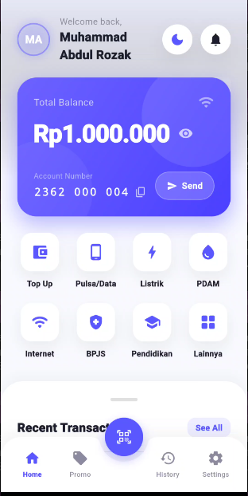
  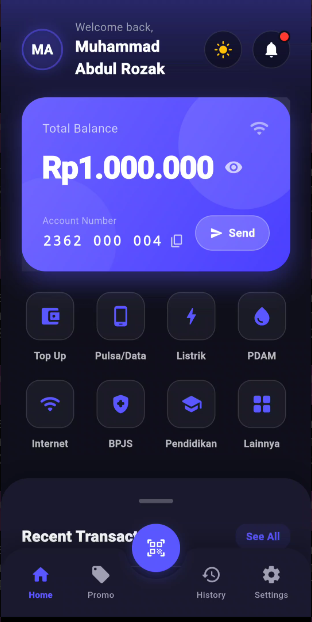
</p>

### Autentikasi & Keamanan
<p float="left">
  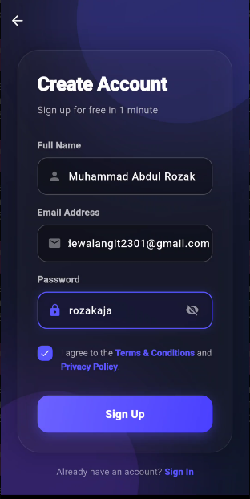
  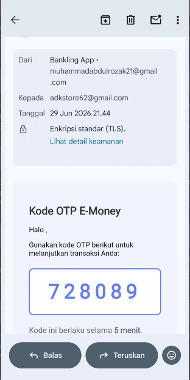
  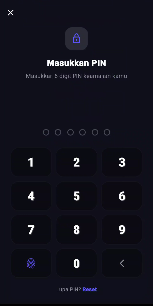
  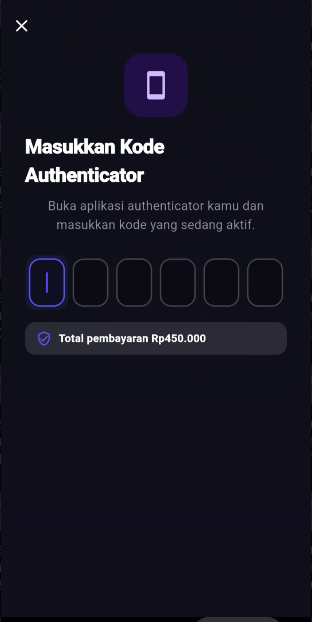
</p>

### Transaksi & Pembayaran
<p float="left">
  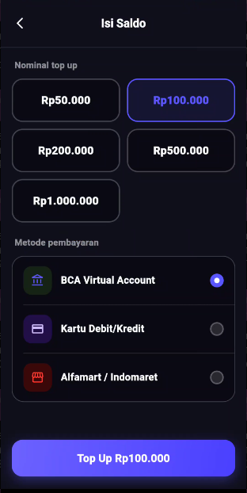
  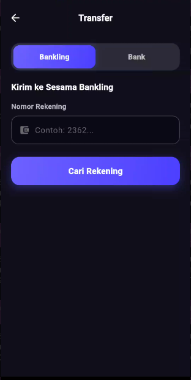
  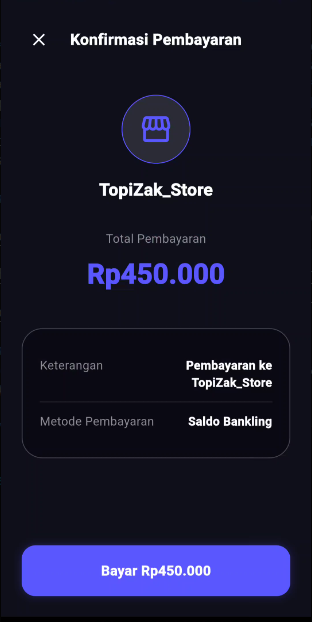
</p>

### Riwayat & Keberhasilan
<p float="left">
  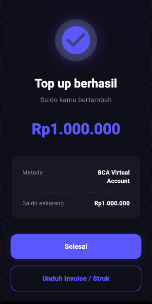
  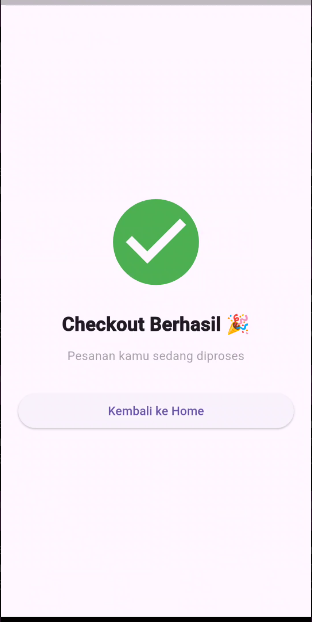
  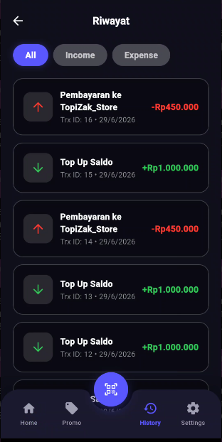
</p>

### Fitur Lainnya (Promo & Notifikasi)
<p float="left">
  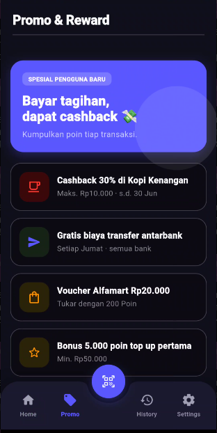
  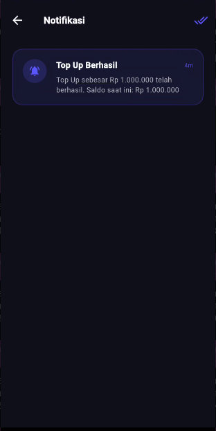
</p>

## Fitur Utama

- **Modern & Adaptive UI**: Menggunakan design system yang elegan (font Inter, aksen Blue Primary) dengan dukungan penuh untuk Light Mode dan Dark Mode secara dinamis.
- **Integrasi Deeplink Pembayaran**: Sistem checkout instan (Payment Gateway) yang dapat dipanggil dari aplikasi pihak ketiga (misalnya aplikasi e-commerce seperti TopiZak_Store) menggunakan skema URL `bankling://pay`.
- **Keamanan Berlapis (Security)**: 
  - Sistem penguncian aplikasi dengan PIN (6 digit) dan Biometrik (Sidik Jari/FaceID).
  - Integrasi 2-Factor Authentication (2FA) menggunakan OTP Email dan Authenticator App (TOTP).
- **Layanan Transaksi Finansial**:
  - Transfer Saldo Antarbank & Sesama Pengguna.
  - PPOB (Pengisian Pulsa, Paket Data, Token Listrik PLN, Tagihan PDAM, BPJS, dll).
  - Pemindaian (Scan) dan Pembayaran via QRIS.
  - Top Up Saldo instan.
- **Manajemen Transaksi**: Notifikasi real-time dan riwayat mutasi/transaksi yang detail beserta e-Struk (Receipt) digital.

## Arsitektur & Teknologi

Proyek ini dikembangkan dengan menerapkan prinsip **Clean Architecture** (Domain, Data, Presentation) dan pemisahan concern yang jelas untuk mempermudah skalabilitas tim dan aplikasi.

- **Frontend**: Flutter & Dart
- **State Management**: BLoC (Business Logic Component) / Cubit
- **Routing**: GoRouter (Dukungan deep-linking tingkat lanjut)
- **Desain System**: Kustom (ThemeData, MediaQuery, dan komponen terpisah)
- **Layanan Eksternal**: Integrasi mock / REST API (tergantung environment)

## Cara Menjalankan Aplikasi

1. **Persyaratan Sistem**:
   - Flutter SDK versi terbaru (>=3.0.0).
   - Android Studio / VS Code dengan ekstensi Flutter.
   - Emulator Android / Simulator iOS, atau perangkat fisik yang tersambung.

2. **Kloning dan Instalasi**:
   Buka terminal, navigasikan ke direktori proyek, lalu jalankan perintah berikut:
   ```bash
   # Unduh semua dependensi
   flutter pub get
   
   # Jalankan aplikasi (Debug Mode)
   flutter run
   ```

3. **Membangun untuk Produksi (Release)**:
   ```bash
   # Untuk Android (APK)
   flutter build apk --release

   # Untuk Android (App Bundle / Play Store)
   flutter build appbundle --release
   ```

## Struktur Direktori Utama

```
lib/
├── core/           # Konfigurasi tema, router, utilitas, dan service (Deeplink, Notif)
├── data/           # Repositori data, model, API client, dan local storage
├── domain/         # Business logic, entitas, dan use case
├── injection/      # Dependency Injection setup (GetIt)
├── presentation/   # UI Layer
│   ├── blocs/      # State Management (AuthBloc, AccountBloc, ThemeCubit)
│   ├── pages/      # Halaman aplikasi (Auth, Home, Payment, Transfer, History, dll)
│   └── widgets/    # Komponen UI Reusable (AppButton, AppField, PinPad, dll)
└── main.dart       # Entry point aplikasi
```

## Berkontribusi
Semua commit dan modifikasi pada proyek ini diutamakan menggunakan struktur Conventional Commits. Jika Anda ingin menambahkan fitur, pastikan antarmuka UI mematuhi standar palet warna AppColors.bluePrimary dan font Inter agar konsisten dengan ekosistem Bankling.

## Pengembang
- **Nama**: Muhammad abdul Rozak
- **NIM**: 1123150006
